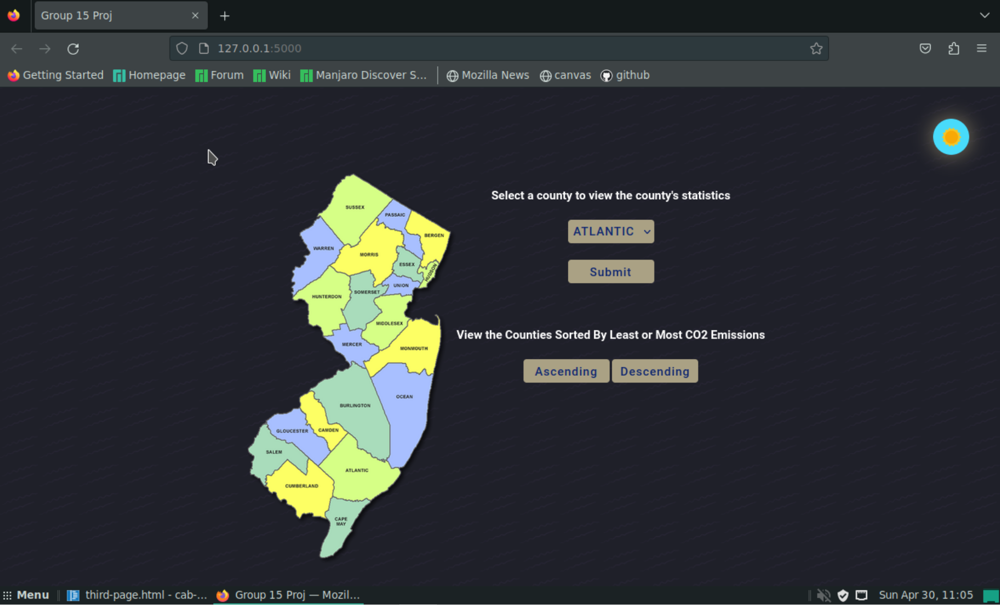
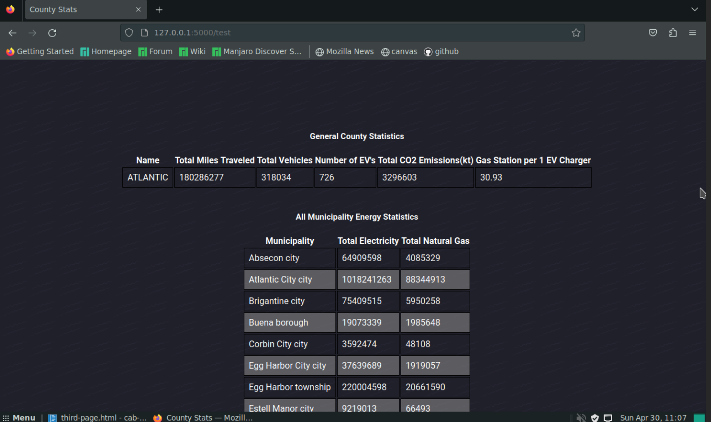
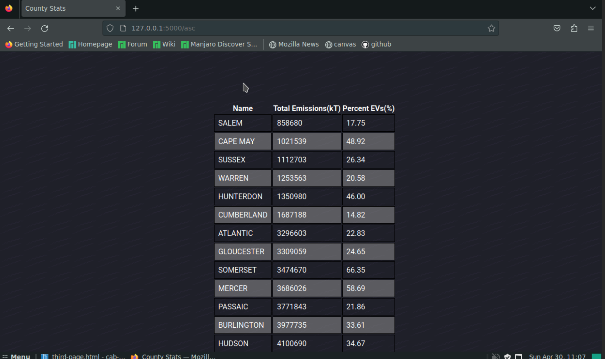

# **GROUP 15 DATABASE**
<br>

## Overview 

### In our database is a collection of data for each county or municipality in New Jersey. To navigate our datbase is simple, and it can be used to find the statistics related to total emissions, electric vehicle use, overall energy use, as well as gas station and electric vehicle charger addresses.
<br>

## Installation & Usage

### 1) Download the repository to your home directory
### 2) One-Time Installation

You must perform this one-time installation in the CSC 315 VM:

```
# install python pip and psycopg2 packages
sudo pacman -Syu
sudo pacman -S python-pip python-psycopg2

# install flask
pip install flask
``` 
### 3) Usage

To run the Flask application, simply execute:

```
cd cab-project-15
cd src
./Database.sh
cd web_app
export FLASK_APP=app.py
flask run
# then browse to http://127.0.0.1:5000/
```
<br>

<br>

## Screenshots
  


